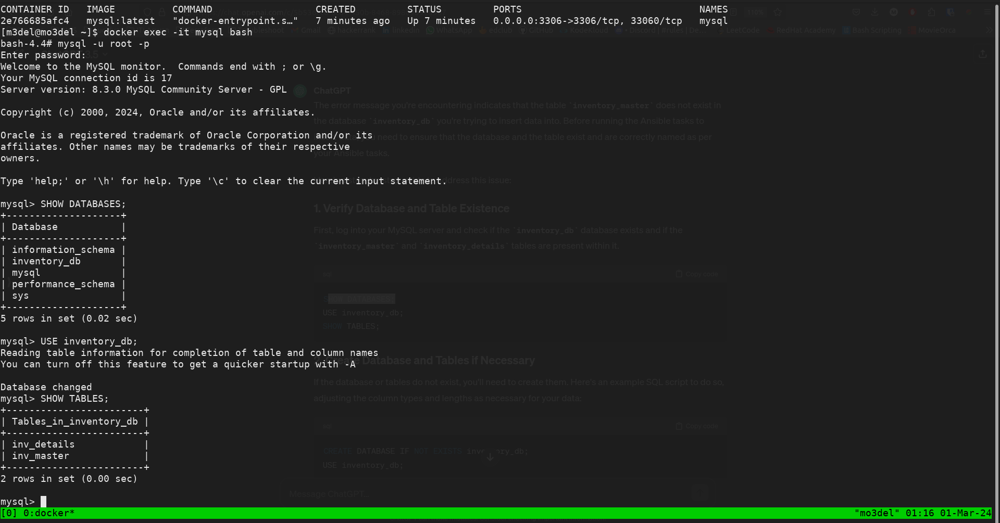
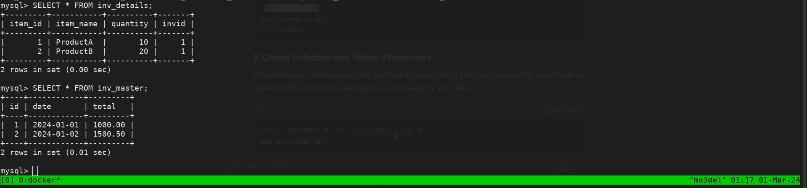

# Create MySQL Container with Ansible

This project automates the setup of a MySQL database within a Docker container using Ansible. It ensures that the necessary environment, including the database and required tables, is prepared and ready for use.

## Features

- Automated MySQL container deployment
- Creation of specified databases and tables
- Data insertion into tables from predefined files

## Requirements

- Docker
- Ansible
- Python 3
- Pip packages: `pymysql`, `mysql-connector-python`, `cryptography`

## Getting Started

### Introduction

This Ansible playbook is designed to streamline the deployment of a MySQL database inside a Docker container. It handles the installation of necessary dependencies, container deployment, database and table creation, and initial data loading.

### Frok this repo

Fork the repository by clicking the "Fork" button on the top right corner of this page. This will create a copy of the repository under your GitHub account.

### Clon this repo

Clone the forked repository to your local machine using the following command:

```bash
$ git clone https://github.com/<your-username>/Create_MySQL_Container_By_Ansible.git
```

Replace `your-username` with your GitHub username.

### Change directory

1. Change into the cloned repository directory:

```bash
$ cd Create_MySQL_Container_By_Ansible
```

2. Update the `inventory` file with the IP address .

3. Update the `ansible.cfg` file with the private key.

4. Update the `vars/main.yml` file with the desired MySQL root password.

5. Run the following command to execute the playbook:

```bash
$ ansible-playbook  playbook.yml
```

### Initial Setup

1. **Install Dependencies**: Ensure Docker and Ansible are installed on your system.
2. **Prepare Ansible Environment**: Place the provided Ansible playbook in your project directory.
3. **Configuration**: Customize the variables in the playbook as per your requirements, such as database name, user, and password.

### Verification

1. **Verification**: Once the playbook execution is complete, you can verify the setup by checking the Docker container status and accessing the MySQL database within the container.



## Playbook Overview

- **Pause for Confirmation**: Initially, it prompts for confirmation to proceed with the setup.
- **Install Dependencies**: Installs required system packages and Python pip packages.
- **Ensure MariaDB Container Running**: Deploys a MySQL Docker container if not already running.
- **Database Setup**: Creates the specified database and tables (inv_master and inv_details).
- **Data Insertion**: Inserts data into the tables from predefined files using template-generated data files.

## Customization

You can customize the playbook by adjusting variables such as `db_name`, `db_user`, and `db_password` to match your specific requirements. Additionally, you can modify the SQL queries and the data file templates (`inv_master.txt.j2` and `inv_details.txt.j2`) to fit your data schema.

## Troubleshooting

- **Container Not Starting**: Ensure Docker is running and you have the necessary permissions to deploy containers.
- **Database Connection Issues**: Verify the container's IP address and the database credentials.
- **Data Insertion Errors**: Check the format and content of the data files to ensure they match the expected schema.

## Contributing

Contributions to enhance this project are welcome. Please adhere to standard coding practices and provide documentation for any new features or fixes.